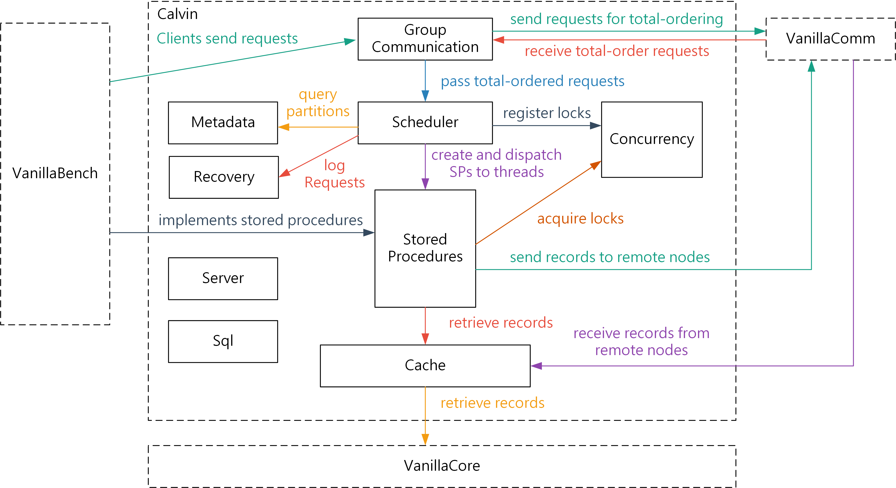

# Final Project

Let's implement a great distributed database architecture 'Calvin'.

[Introduction](https://nthu-datalab.github.io/db/labs/introduction-final-project.pdf)

## Steps

1. Fork this project
2. Implement your code under the `Calvin` directory (please follow the basic maven directory hierarchy.)
3. Revise the benchmarks (`VanillaBench`) in order to make the benchmarks run on Calvin.
4. Devise & run some experiments
5. Write a report about your implementation and experiments
6. Push your repo to Gitlab and submit a merge request

## Architecture

The following figure demonstrates an example for the architecture of an implementation of Calvin. You may not need to follow this architecture.

Here is the workflow of executing a stored procedure:

1. The clinet (VanillaBench) sends a stored procedure request.
2. The group communication module receives the request and then passes the request to VanillaComm for total-ordering.
3. The group communication module receives total-ordered requests from VanillaComm, and then it passes these requests to the scheduler.
4. The scheduler analyzes each request, logs each request, generates an execution plan, registers locks for conservative locking, and then creates a stored procedure instance and dispatches the instance to a thread for execution.
    - During the analysis, it may have to query the metadata module for the partitions (the locations) of the requested records.
5. During the execution of a stored procedure, it retrieves records from the cache module, which further retrieves records from the storage engine of VanillaCore.
6. If a stored procedure needs to deliver a record to a remote node, it will send the record using P2p messaging API provided by VanillaComm. VanillaComm may also pass the received records to the cache module.
7. After the stored procedure finishes the execution, it commits the transaction and then sends the result back to the clinet (VanillaBench).

## Requirements

In order to evaluate your implementations, we require you to implement at least the following functionalities:

- Communication
  - A client-side module to send requests to servers.
  - A server-side module to send total-ordering requests and receive total-ordered messages and P2p messages.
- Scheduler
  - To analyze requests, generate execution plan and dispatch requests to threads.
- Metadata
  - To store data partition information so that other moduels can query data partitions.
- Recovery
  - To log stored procedure requests.
- Concurrency
  - Conservative Locking
- Stored Procedures
  - An abstract class for VanillaBench to implement detailed transaction logics.
  - Able to send records to remote nodes.
  - Able to send the result back to clients (VanillaBench).
- Cache
  - To cache remote records.
  - To retrieve/modify/insert/delete records from/in VanillaCore.

In addition to the above requirements, you also need to show scalabilty of your system. More specific, you have to run at least one experiment that shows the throughput of the system with 1~3 servers (or more).

## Constraints

Basically, there is no constraint in the final project.
You can use any api in vanillaComm, vanillaCore, vanillaBench and do any modification you want to them.

Enjoy & have fun

## Submission

The procedure of submission is as following:

1. Fork our [Final-project](https://shwu10.cs.nthu.edu.tw/courses/databases/2020-spring/db20-final-project) on GitLab
2. Clone the repository you forked
3. Finish your work and write the report
4. Commit your work, push your work to GitLab.
   - Name your report as `[Team Member 1 ID]_[Team Member 2 ID]_final_project_report`
     - E.g. `102062563_103062528_final_project_report.pdf`
5. Open a merge request to the original repository.
   - Source branch: Your working branch.
   - Target branch: The branch with your team number. (e.g. `team-1`)
   - Title: `Team-X Submission` (e.g. `Team-1 Submission`).

**Important: We do not accept late submission.**

## The report

- Explain what you do
- Experiments
  - show your benchmark result

Note: There is no strict limitation to the length of your report. Generally, a 2~3 pages report with some figures and tables is fine. **Remember to include all the group members' student IDs in your report.**

## No Plagiarism Will Be Tolerated

If we find you copy someone’s code, you will get 0 point for this assignment.

## Deadline

Submit your work before 2020/6/21 (Sun.) 23:59:59 (Phase 1).
